+++
date = '2026-02-26T08:18:47+08:00'
draft = true
title = 'Armaxisctf2024'
+++

Hack The Box - University CTF 2024: Binary Badlands (Armaxis)
Participating in my first Capture The Flag (CTF) competition has been an exciting and rewarding experience. As someone eager to deepen my understanding of cybersecurity concepts, this hands-on challenge provided a unique opportunity to apply my knowledge in a practical setting. From problem-solving to learning new techniques, the experience not only enhanced my skills but also gave me valuable insights into real-world cybersecurity scenarios.

**Details:**
Web Exploitation

**Armaxis**
In the depths of the Frontier, Armaxis powers the enemy's dominance, dispatching weapons to crush rebellion. Fortified and hidden, it controls vital supply chains. Yet, a flaw whispers of opportunity, a crack to expose its secrets and disrupt their plans. Can you breach Armaxis and turn its power against tyranny?

# Solution
In this challenge, we need to exploit the website of Armaxis, identify potential vulnerabilities, capture the flag, and uncover its secrets.

First, I examined the source code of the provided website. I focused on understanding how the login and signup functionalities interact with the database. Here's what I discovered:

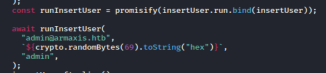

Based on this code, I was able to identify the admin's credentials, but I still needed to obtain their password. I attempted to access the admin account using SQL injection, but the attempt was unsuccessful. I also tried intercepting the website traffic with Burp Suite and modifying the role to "admin," but this approach did not work either.

Next, I attempted to reset the admin's password. During this process, I noticed that a token code was generated for resetting the password.

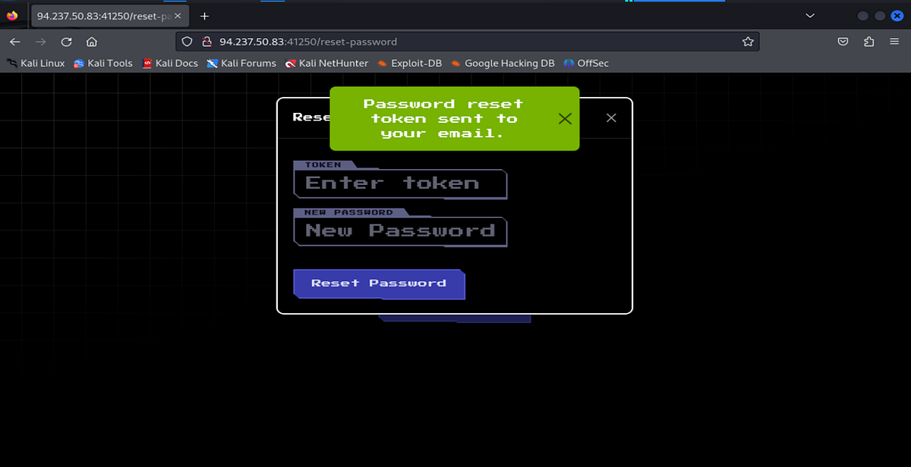

Upon inspecting the token through the BurpSuite Intercept, I realized it was a **JSON Web Token (JWT)**. I tried intercepting the token and modifying it by changing the role from "user" to "admin." However, when I submitted the modified token and attempted to create a new password, I was redirected to an **"Invalid Token"** page.

Another website was provided as part of the challenge, so I decided to investigate it. This led me to a new page:

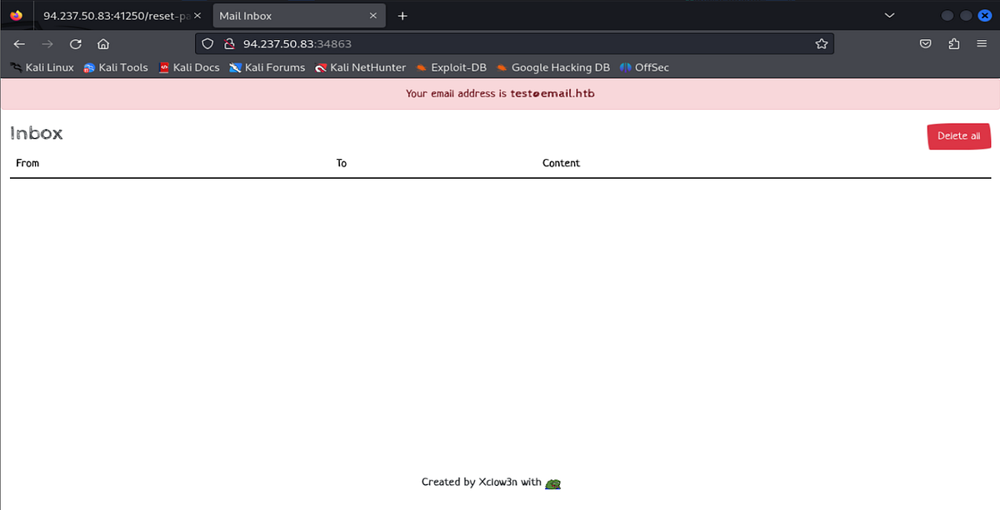

I considered creating an account with the email address provided on this page and then attempting to elevate its role to "admin," but this approach also failed. However, from the source code, I discovered that the reset tokens were valid for one hour. This gave me an idea: perhaps I could use the token sent to test@email.htb and apply it to the admin@armaxis.htb account.

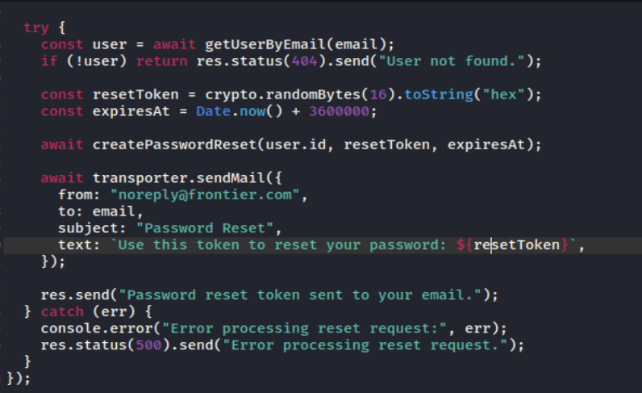

After creating a new account, I quickly attempted to change the password to capture the token. Sure enough, the system sent a reset token to the "test email."

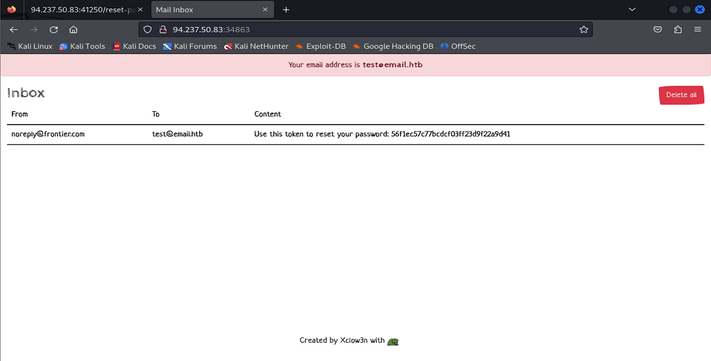

I then logged back into the system, initiated another password reset, and entered the admin credentials along with the token I intercepted from the email. Then the password reset was successful!

The first vulnerability we uncovered was related to JWT Token Generation, as the application generated identical tokens for resetting passwords.

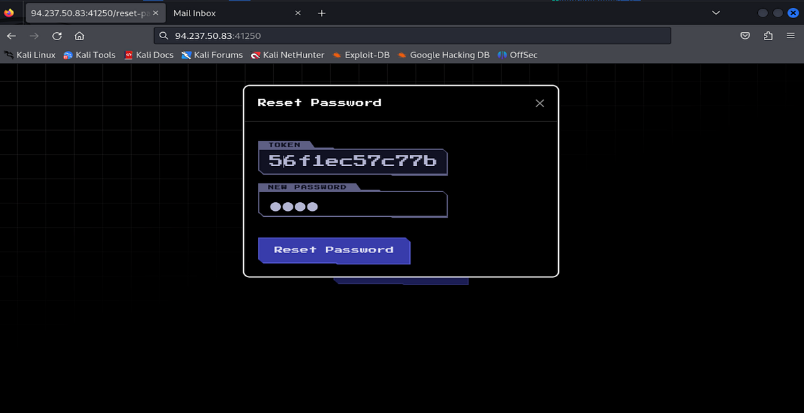

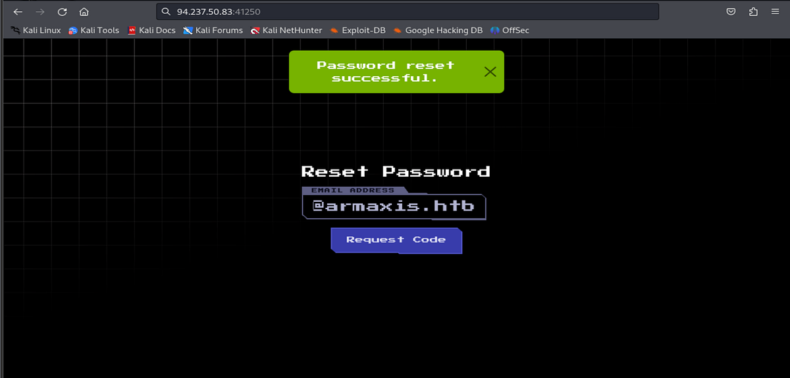

After successfully logging in as the admin, I navigated to the "Dispatch" page. There, I found a form labeled "Note (Markdown)" which hinted at a potential exploitation vector. Additionally, a script file, markdown.js, was present, further confirming the possibility of a Markdown-based vulnerability.

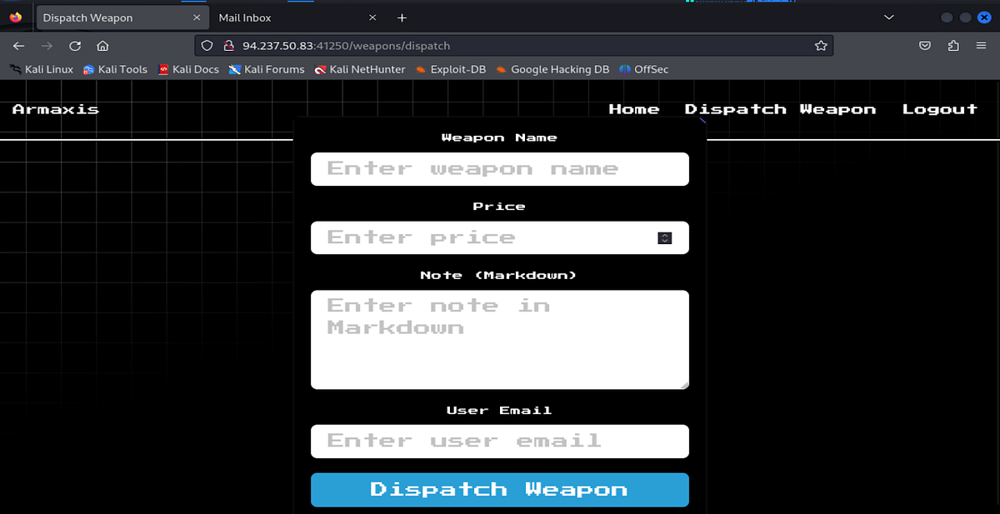

While exploring potential exploits, my friend Xeipher, identified a way to exploit server-side command injection vulnerabilities. These vulnerabilities occur when the application improperly sanitizes input during Markdown processing, particularly with image elements.
We crafted a payload to exploit this vulnerability. The payload was designed to execute a command to locate a file named "flag" on the server. The injection code was as follows:
``

The explanation for this exploit is that

find / -type f -name "flag":

Searches the entire filesystem (/) for a file named "flag"

2>/dev/null:
Redirects error messages (stderr) to /dev/null to suppress them. This keeps the output clean and avoids disclosing unnecessary errors that might alert the target.

By injecting this payload, we aimed to exploit the Markdown processor to execute the command on the server.

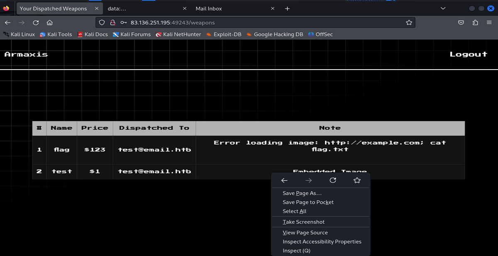

I dispatched it to the admin email so that I would not need to logout. After I "Dispatche Weapon", I will open up the View Source by right clicking it and opening the image soruce
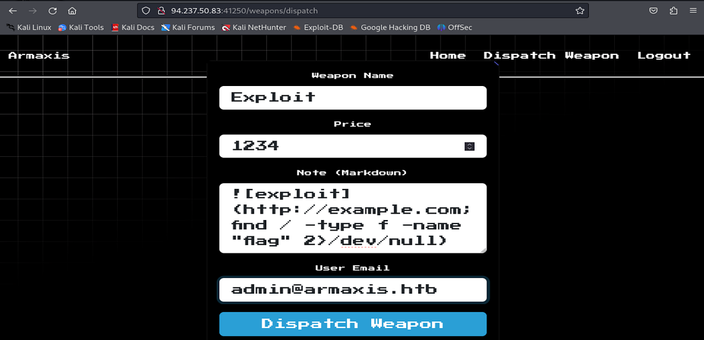

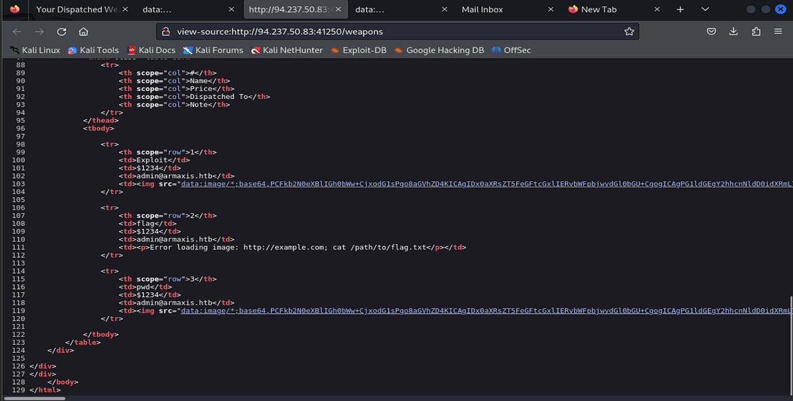

Then I will enter the following command again to show the flag
The exploit targets a server-side command injection vulnerability in the Markdown processor of the application. When a Markdown image is rendered, the processor fails to sanitize the input properly, allowing malicious commands to be executed on the server.

``

injects a command (cat /path/to/flag.txt) after the semicolon (;), which the server interprets as a separate shell command. This command reads the contents of the flag.txt file, effectively exposing sensitive data.

By embedding the payload in the Markdown form, the vulnerability was exploited to retrieve the flag.
Then the flag was displayed in the View Source command and captured it

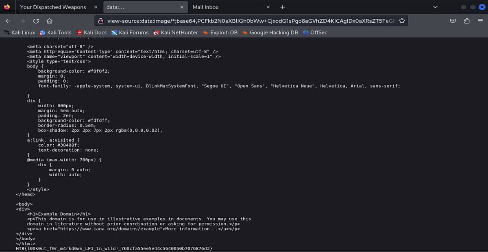

FLAG: HTB{l00k0ut_f0r_m4rkd0wn_LF1_1n_w1ld!_760cfa55ee5e44c5640050b7076876d3}

# Conclusion:
I want to thank my friend Xeipher for discovering the server-side command injection vulnerability in the markdown page when "dispatching the weapons"